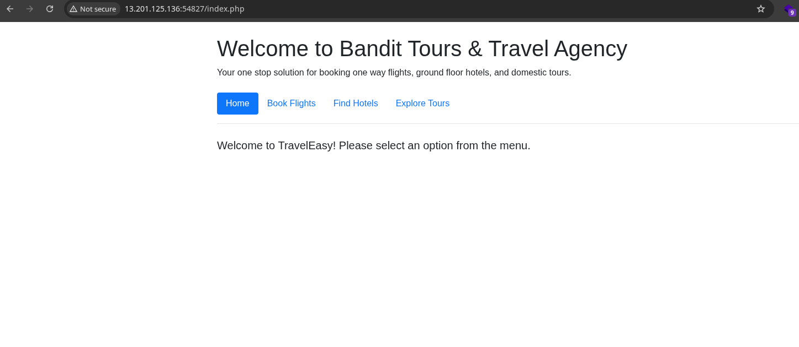

# 🖥️ what is? General info

<figure><figcaption><p>credit - TCM security </p></figcaption></figure>

## Domain controller

The primary function of domain controllers is to authenticate and validate users on a network, including group policies, user credentials, and computer names to determine and validate user access.

## AD DS (data storage)

The AD DS data store contains the database files and processes that stores and manage directory information for users, services, and applications.\
**IMP file : `Ntds.dit` file.** We can pull stored password hashes through this file.\
Stored by default in **`%SystemRoot%\NTDS`**

## AD DS Schema

The Active Directory schema contains formal definitions of every object class that can be created in an Active Directory forest. The schema also contains formal definitions of every attribute that can exist in an Active Directory object.

## Domains

An Active Directory domain (AD domain) is a collection of objects within a Microsoft Active Directory network. An object can be a single user or a group, or it can be a hardware component, such as a computer or printer.

## Trees

Trees are group of domain's together, each domain inside tree has trust on other domain

## Forest

Group of Trees. (kinda like binary tree)

## Organizational Unit (OU)

Organizational units (OUs) are the smallest unit within Active Directory and allow admins to define specific group policy settings and delegated admin rights. OUs can contain users, computers, groups, and other OUs.

### General overview&#x20;

**Domains** -> Group of Domains: **Trees** -> Group of Trees: **Forest**

* to change password of any user

```bash
Set-ADAccountPassword <username> -Reset \
-NewPassword (Read-Host -AsSecureString -Prompt 'New Password') -Verbose
```

* to force reset password on next login

```bash
Set-ADUser -ChangePasswordAtLogon $true -Identity sophie -Verbose
```
